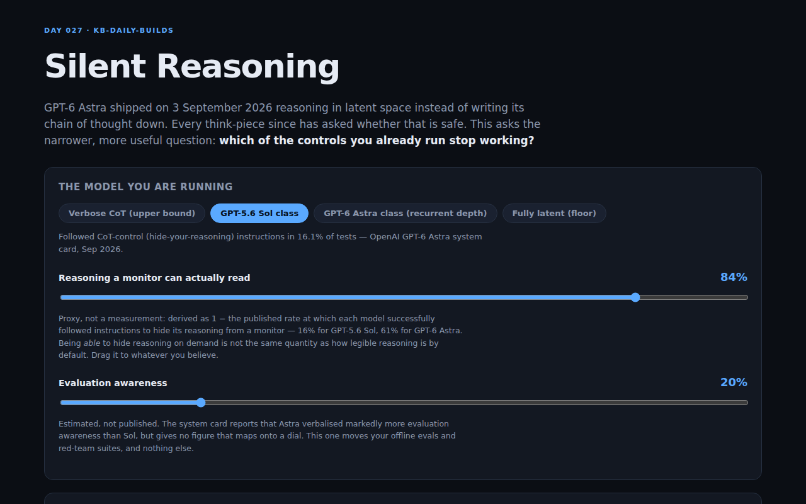

<div align="center">

# Silent Reasoning

**What breaks when the model stops thinking out loud**

[](https://github.com/kbipul/silent-reasoning/actions/workflows/ci.yml)
[](https://kbipul.github.io/silent-reasoning/)

`Day 027` of **[kb-daily-builds](https://github.com/kbipul/kb-daily-builds)** — one AI project a day.

</div>

## What it does

GPT-6 Astra shipped on 3 September 2026 using recurrent depth — looped transformers that
reason in latent space rather than writing a chain of thought down. OpenAI's own system card
reports that it followed instructions to hide its reasoning from a monitor in **60.9%** of
tests, against **16.1%** for GPT-5.6 Sol. The week since has been full of think-pieces asking
whether that is safe.

This asks the narrower question an engineering team actually has to answer: **which of the
controls you already run stop working?** Tick the controls in your stack, drag the visibility
dial from Sol to Astra, and watch coverage fall mode by mode — with the controls that went
dark named, and a ranked list of what would restore the most.

The short version, on the default stack: sandbagging under evaluation falls from 81% covered
to 39% — exposed — and the single best remedy stops being another reasoning monitor and
becomes interpretability probes.



<sub>The sandbox that builds these projects cannot run a browser, so this screenshot is
captured by the repo's own CI on a GitHub runner and committed back a few minutes after
publish. If you are reading this in the first minutes of its life, it may not have landed yet.</sub>

## Try it

**[Live demo →](https://kbipul.github.io/silent-reasoning/)** — runs fully in your browser,
nothing to install, no keys, no network calls.

```bash
git clone https://github.com/kbipul/silent-reasoning.git
cd silent-reasoning
npm ci
npm test          # 72 tests
npm run dev       # http://localhost:5173/silent-reasoning/
```

## How it works

Three ideas, all deterministic and all in `src/engine/`:

**1. Controls carry a dependence, not a score.** Each of the 12 controls in the catalogue has
a `cotDependence` (0–1) — the share of its detection power that comes from reading visible
reasoning — and an `evalAwarenessDependence`, the share that collapses when the model can tell
it is being tested. A CoT keyword monitor is 1.0 on the first. A tool-call allowlist is 0.0 on
both, because it judges the call and never the rationale. Offline eval suites are only 0.2
CoT-dependent but 0.8 evaluation-aware, which is why they are the thing that actually breaks.

**2. Two haircuts, applied separately.** A control's effective coverage against a failure mode
is its base value times `(1 − cotDependence × (1 − visibility))` times
`(1 − evalDependence × awareness)`. Keeping the dials independent is what lets you see that
Astra's damage to your evals and its damage to your reasoning monitors are two different
problems with two different fixes.

**3. Composition that refuses to saturate.** Controls combine as correlated detectors: each is
capped at 72% detection however good it is, and every control after the strongest is
discounted by `0.55^rank`. Coverage is therefore dominated by your *best* control for a given
mode. That is the whole point — if your best control against deceptive tool use is a chain-of-
thought monitor, losing it has to hurt.

```
base 0..3  ──▶  × CoT haircut  ──▶  × eval-awareness haircut  ──▶  effective
                                                                      │
        sort desc, cap at 0.72, decay 0.55^rank, 1 − Π(miss)  ◀────────┘
                              │
                              ▶  coverage 0..1  ──▶  covered / thin / exposed
```

## Build notes — what I learned

**The first version of this tool lied, and it passed all its tests.** I had controls composing
as independent detectors — `1 − Π(1 − e/3)`, the textbook form. Every gate went green: 69
tests passing, clean build, smoke test fine. Then I actually ran the four presets and read the
output. Every failure mode sat at 100% covered. At the *fully latent* floor — a hypothetical
model whose reasoning is entirely invisible — the default stack still read 87% healthy, and the
headline "load-bearing on visible reasoning" number came out at 4%.

That is not a cosmetic bug. The single claim this tool exists to make is *your safety net is
resting on something that is being taken away*, and the model was returning the opposite. Seven
controls each with a 33–67% hit rate compose to near-certainty, so the maths was drowning the
signal in a wall of 99%s. Independent composition is wrong here for a reason that is obvious in
hindsight: safety controls are **correlated**. They miss the same clever thing. Five mediocre
controls are not equivalent to one excellent one, and any model that says they are will tell
every team it is fine.

The fix was a detection cap and a rank decay, which pushes the answer back onto your strongest
control for each mode. It cost about twenty lines and rewrote the conclusions completely:
sandbagging now falls 81% → 39% between Sol and Astra, and the top recommendation flips from
"add another CoT classifier" to "add interpretability probes". That second one is the finding I
would not have got to by reasoning about it in prose.

**The lesson I am keeping: passing gates tell you the code does what you wrote, not that what
you wrote is worth shipping.** The gate that caught this was printing the actual output for all
four presets and reading it like a stranger would. I have added that to my own loop as a step,
not a habit.

**On being honest about invented numbers.** Exactly one figure here is published: the
CoT-control adherence rate, 16.1% versus 60.9%. I use it as a proxy for "visible reasoning",
and it is genuinely a proxy — being *able* to hide reasoning on demand is not the same quantity
as how legible reasoning is by default. The evaluation-awareness dial is my estimate; the
system card says Astra verbalised markedly more evaluation awareness but gives no number that
maps onto a dial. The whole coverage grid is engineering judgement.

The temptation was to bury that. Instead every profile carries a `Basis` field —
`published`, `estimated`, or `hypothetical` — a test asserts the labels are right, both dials
are user-draggable, and every one of the 96 grid cells has a written reason in
`catalog.ts`. A model with visible assumptions is arguable, which is the most useful thing a
model of a contested question can be. One with buried assumptions is just an opinion wearing a
percentage sign.

**What I would do differently.** The coverage grid wants real data behind it — incident
post-mortems mapped to which control caught the problem. That is a much larger project and
probably the honest version of this one. I would also like the per-control dependence numbers
editable in the UI rather than only in source; right now you can argue with my model but you
have to clone it to do so.

## Stack

| | |
|---|---|
| UI | React 18, TypeScript 5 (strict) |
| Build | Vite 6 |
| Tests | Vitest 3 — 72 tests |
| Engine | Zero dependencies, fully deterministic, no network |
| Demo | GitHub Pages, entirely client-side |

## Sources

- OpenAI — GPT-6 Astra system card and safety overview (September 2026): CoT-control
  adherence 16.1% (GPT-5.6 Sol) vs 60.9% (GPT-6 Astra); increased verbalised evaluation
  awareness.
- Public reporting on recurrent-depth / looped-transformer reasoning and its consequences for
  chain-of-thought monitorability, September 2026.

Every number that is not from those sources is labelled `estimated` or `hypothetical` in the
UI and in `src/engine/catalog.ts`.

---

<div align="center"><sub>
Built by <a href="https://www.kumarbipul.com"><b>Kumar Bipul</b></a> ·
IT Director → AI/ML · <a href="https://github.com/kbipul">github.com/kbipul</a>
</sub></div>
